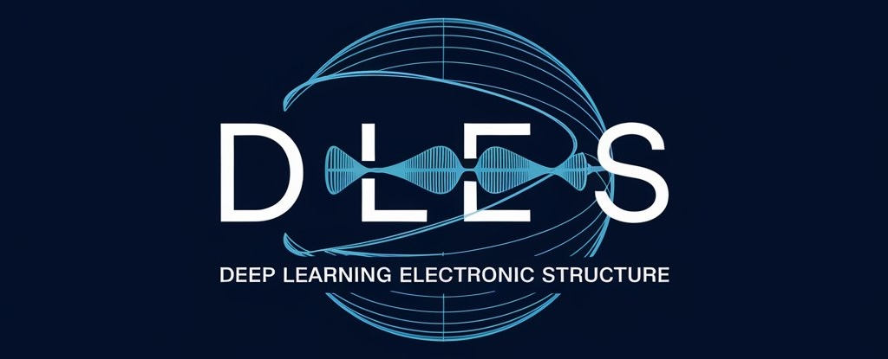

# Deep Learning Electronic Structure
DLES is a Python package to load and manipulate molecule data using [ASE](https://wiki.fysik.dtu.dk/ase/) and to carry out quantum chemistry methods using [PySCF](https://pyscf.org).
It is an REAongoing project, which will be further developed for deep learning applications. 

## Installation

Clone the project https://github.com/RAI-SCC/DLES.git and install it with `pip install -e .`.

## Data Handling

DLES is able to
- read chemical structure data from HDF5 files with a certain structure.
- save specific structures as coord- or xyz-files using [ASE](https://wiki.fysik.dtu.dk/ase/) (atomic simulation environment)
- make memory estimation for matrices generated during Hartree-Fock computations

## Hartree-Fock Computations
DLES imports [PySCF](https://pyscf.org) to systematically carry out restricted Hartree-Fock computations.

## Deep Learning
DL applications are not implemented yet. Our aim is learning the electronic structure of molecules.